

<h1 align="center">
  <a href="https://github.com/ShibamRoy9826/HackNet/releases/">
    
     
    HackNet
  </a>
</h1>

  
  

<b>Social media for hackclubbers</b>

  <a href="#intro">Introduction</a> •
  <a href="#installation">Installation</a> •
  <a href="#features">Features</a> •
  <a href="#tech-stack-used">Tech Stack</a> •
  <a href="#screenshots">Screenshots</a> •
  <a href="#faq">FAQ</a>

<h2 align="center" id="intro">🧩 Introduction</h2>

A Social media app made for Hackclubbers, with ❤️ by a Hackclubber.
Use it just like any other social media application and share your progress on different projects with others, make friends, chat with them, and most importantly ENJOY:)

> [!NOTE]
> It's still under development, so if you face any problems while using it, please raise an issue!
> I would appreciate any feedback too, raise an issue for that as well:)

<h2 align="center" id="video-demo">🎥 Video Demo</h2>

If the URL given below doesn't work, try <a href="https://hc-cdn.hel1.your-objectstorage.com/s/v3/06218d408f645bc043eb8a445c999f2c8f5b52d0_hacknetdemo.mp4">this</a>

  

<h2 align="center" id="installation">💻 Installation</h2>
You can download the latest apk from the [GitHub releases page](https://github.com/ShibamRoy9826/HackNet/releases/)

Steps are simple, but **Please make sure to install it on an Android device ONLY!** , it will not work elsewhere:

1. Click on [this link](https://github.com/ShibamRoy9826/HackNet/releases/)

2. Find the latest release, and click on this:

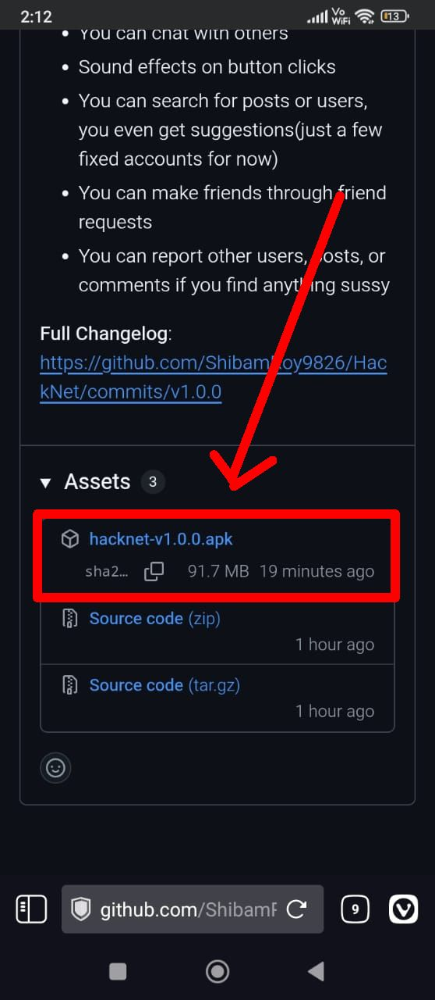

3. It will start downloading, once finished downloading, click on it:

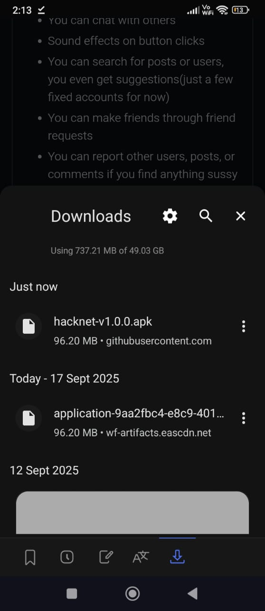

4. If it's your first time installing an external apk, you will be asked to allow installation from unknown sources, Please turn that option on in order to install HackNet.

5. Open your app, sign up and enjoy!

<h2 align="center" id="features">✨ Features</h2>

- Simple Sign up with email verification
- Straightforward UI with 3 different themes: Default(Hackclub colors), Catppuccin(Mocha), and a Light Theme.
- Obviously you can make posts, containing any video/images, or only-text posts
- You can share posts to others, or copy links of different posts to your clipboard.
- You can make comments on posts
- You can toggle comment section while making the post 
- You can customize your profile as per your liking! it includes avatar customization along with banner customization(it includes built-in options, and you can upload a custom one too)
- You receive notifications(if you allow them) each time someone follows/friends you.
- You can Track/follow or Friend other users
- You can chat with others
- Button click sound effects
- You can search for posts or users, you even get suggestions(just a few fixed accounts for now)
- You can make friends through friend requests
- You can report other users, posts, or comments if you find anything sussy

<h2 align="center" id="tech-stack-used">🛠️ Tech Stack Used</h2>

- Firebase(For both auth and data storage)
- Expo
- React Native
- TypeScript
  
<h2 align="center" id="screenshots">📷 Screenshots</h2>

Most of the images are taken with the *Catppuccin Mocha* theme, however one image each for other themes has also been attached
I wanted to click them with default, but realised after taking all screenshots, maybe I will update later on...

  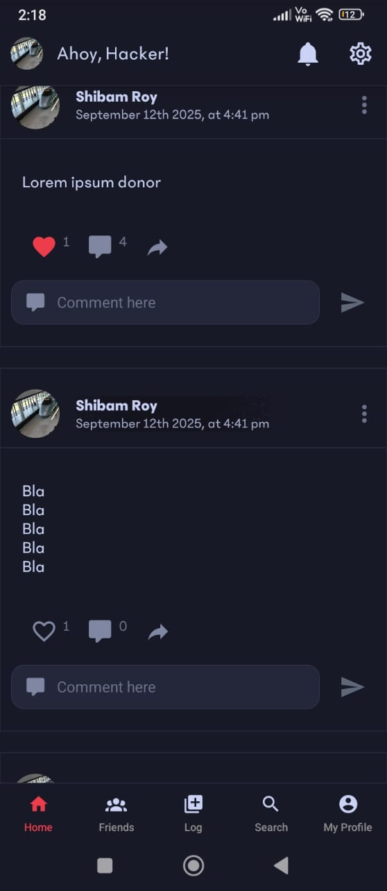
  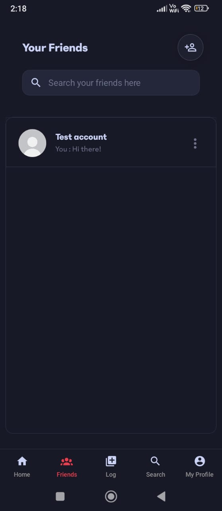
  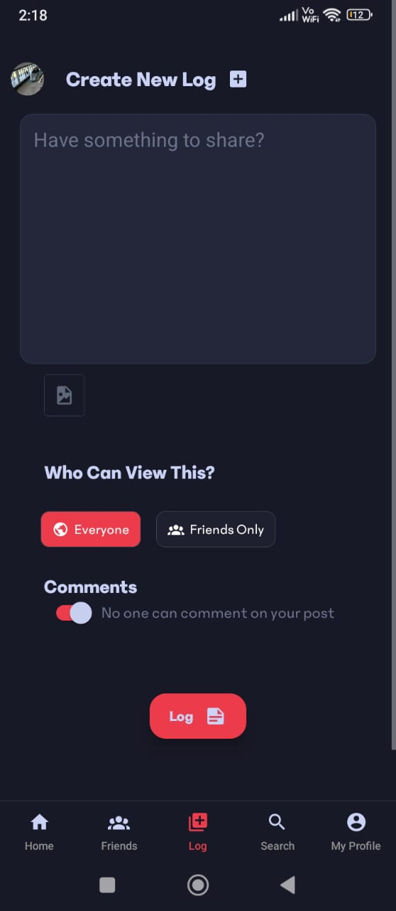
  
  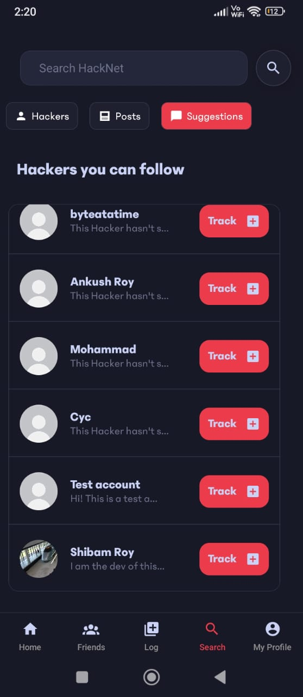
  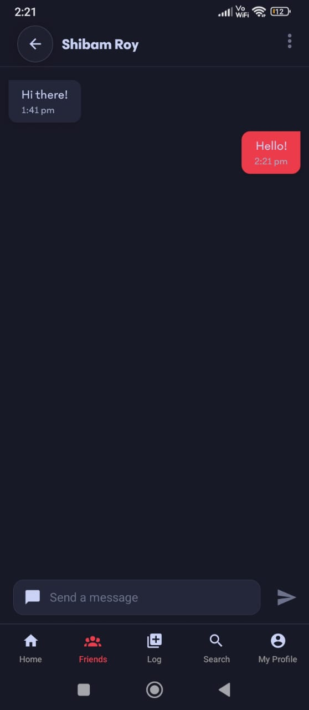
  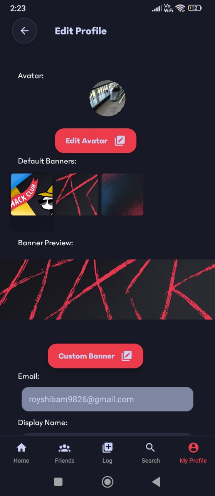
  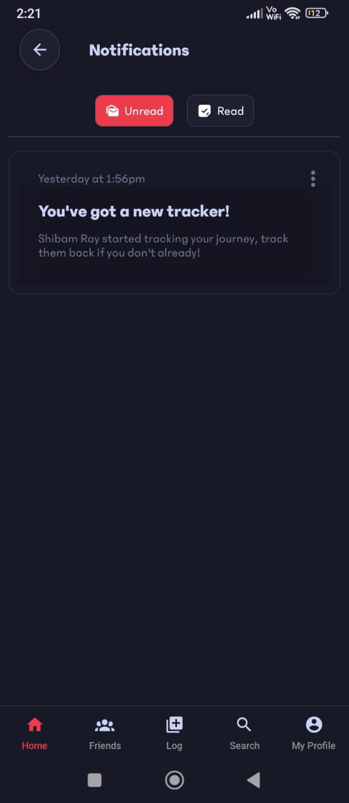
  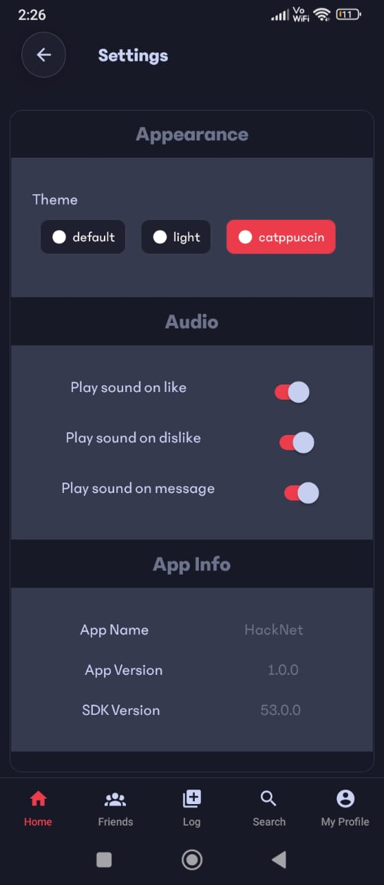
  
  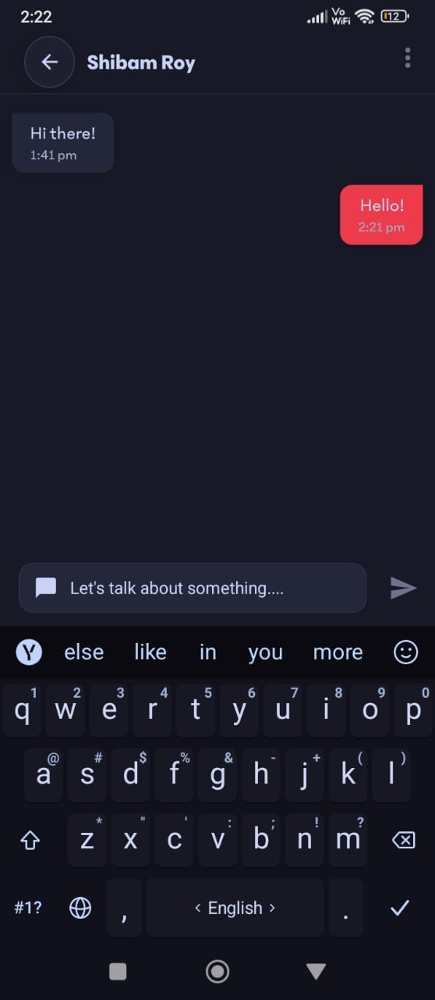
  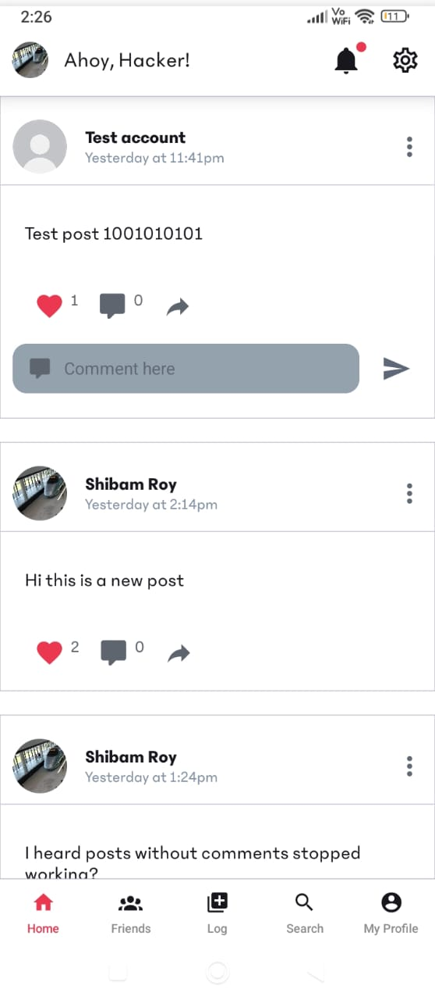
  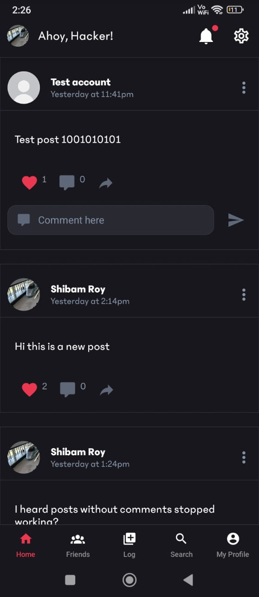

<h2 align="center" id="known-issues">🐛 Known Issues</h2>

- ~You need to close and reopen the app each time user logs in/logs off (I know the cause, its because of a last minute change, will fix in next release)~ fixed
- ~In new log page, the text beside the comment toggling button says the exact opposite of what is going to happen. I don't know how it went unnoticed, but I will fix that too in the next release~ fixed

- comment counts don't update (I know and that's how its supposed to be for now, kinda intentional, will fix later)
  
<h2 align="center" id="faq">❓ FAQ</h2>

### 1. Why should I use this app? and not Slack?
Short answer, vibes, I totally agree with the fact that Slack is probably better than HackNet(as of now) if you want to chat or do anything for that matter. But that probably won't give you the vibes similar to reddit, instagram or other apps, I wanted to make something that gives similar vibes to them. 

For now it doesn't have too many features but that never means that it won't have more features/equivalent features to Slack in the future. UI can be another factor, and for messaging I often find Slack is too sluggish(My app isn't extremely fast either, but at least it feels less sluggish, likely cause it doesn't have anywhere near the amount of data most likely). To be honest, the best I can explain is that "I made it", and that's a reason why I want you to use it!

### 2. New features when?
After a break, I can't give any estimate, whenever I have free time, OR you can make them too! I would love it if you could contribute to this app:)

### 3. What features will be added in the future?
- E2E encrypted chats, Yes I know that's a very big drawback as of now, chats are NOT end to end encrypted, But I assure y'all that I will fix that soon.
- Replies to comments
- Dislike buttons -> Should be easy but I am not making it now, cause it looks messy, I want to keep it minimal for now
- Any feature that you all demand, all I need is free time, you can open an issue to request a new feature. 

<h2 align="center">🌟 Stargazers</h2>

<a href="https://github.com/BlueprintFramework/framework/stargazers/">
  <picture>
    <source media="(prefers-color-scheme: light)" srcset="http://reporoster.com/stars/ShibamRoy9826/HackNet">
    
  </picture>
</a>

<h2 align="center" id="contribution">🤝 Contribution</h2>

You can contribute by raising an issue or making a pull request, I will happily review them and merge them as soon as possible:)

>If you like this app, please star this repo, that will motivate me to develop it further! ✨
